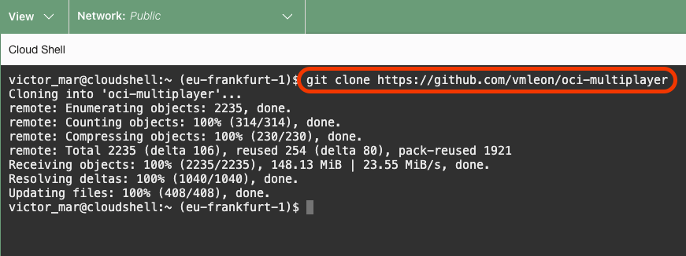

# Initial App Deployment - Virtual Machines

## Introduction

Terraform is an Open Source tool to deploy resources in the cloud using code. This method is typically referred to as Infrastructure as Code (IaC). Terraform configuration is declarative; you simply define what you want in the Oracle Cloud and it ensures the resources are created to your specifications.

Ansible is an Open Source tool that provides both configuration management and infrastructure as code. For this workshop, we leverage the configuration management functionality. Once Terraform deploys the infrastructure, Ansible will establish a remote SSH connection to the servers and apply the requisite configuration (app install, file downloads, configuration settings, etc.)

Estimated Lab Time: 15 minutes

### Objectives

In this lab, you will complete the process of deploying the first form of the Three.js app to the Oracle Cloud. The deployment process utilizes Terraform and Ansible, however, we've provided a script to help streamline the process.

### Prerequisites

* An Oracle Free Tier or Paid Cloud Account


## Task 1: Cloud Shell

1. From the Oracle Cloud Console, click on **Cloud Shell**

    

2. As soon as the Cloud Shell is loaded, you can retrieve the workshop assets for this lab.

    ```
    <copy>git clone https://github.com/vmleon/oci-multiplayer</copy>
    ```

3. The result will look like this:

    

4. Change directory with `cd` to `oci-multiplayer` directory:

    ```
    <copy>cd oci-multiplayer</copy>
    ```

5. Terraform uses a file called `tfvars` that contains variables used to communicate with the Oracle Cloud. You are going to generate that file by running the following command:

    ```
    <copy>npx zx scripts/tfvars.mjs vm</copy>
    ```

6. During the execution of the script, you will have to answer a question. The _VM Deployment Compartment Name_. You just type _**ENTER**_ to select the root compartment. If you are familiar with OCI compartments, then feel free to pick an existing compartment name.

  

## Task 2: Initiate Deployment

1. Run the deployment script which is stored in the _`scripts`_ folder.


    ```
    <copy>./scripts/start_VM.sh</copy>
    ```

2. The script will begin by building the web server packages:

    

3. Once that finishes, it will move on to the Terraform deployment:

    

4. Note that once the Terraform deployment is complete, it will print the public IP addresses of the two servers and the load balancer that was created. No need to capture these now, we'll print them on the screen at the end.

    

5. Copy the _`lb_public_ip`_ value

    

6. Open a new browser tab, and check it out.

    

You may now [proceed to the next lab](#next).

## Acknowledgements

* **Author** - Victor Martin - Technology Product Strategy Director - EMEA
* **Author** - Wojciech (Vojtech) Pluta - Developer Relations - Immersive Technology Lead
* **Author** - Eli Schilling - Developer Advocate - Cloud Native and DevOps
* **Last Updated By/Date** - August, 2023
